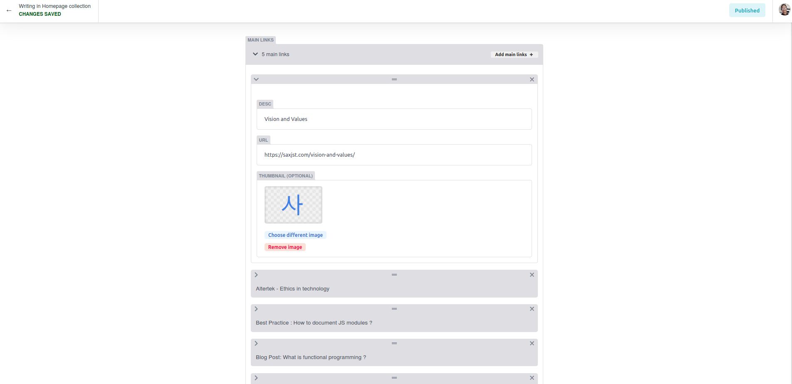
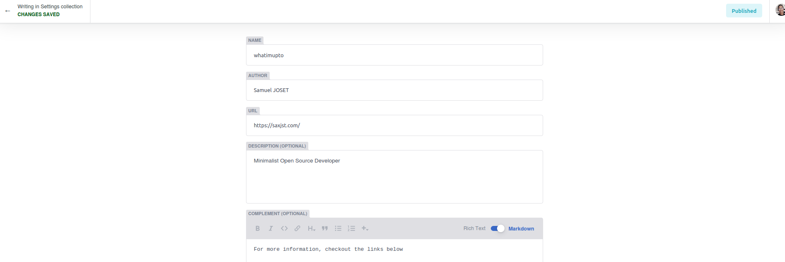

# Whatimupto

> Light and Standalone open source linktree with a git based backend

## Example

https://whatimupto.saxjst.com

### Technologies used:

- [Netlify CMS](https://www.netlifycms.org/)
- [Eleventy](https://www.11ty.dev/)
- [Alpine.js](https://github.com/alpinejs/alpine)
- [Bootstrap](https://getbootstrap.com/)
- [Neat Starter](https://github.com/surjithctly/neat-starter)

## License

MIT © [saxjst](https://saxjst.com)
